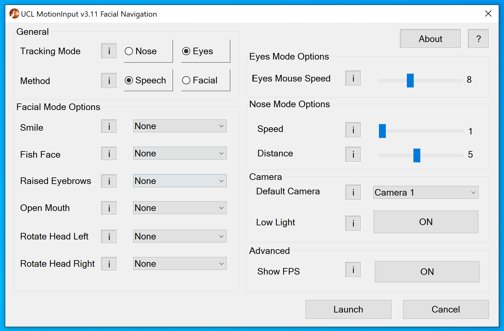

# MI_FacialNavigation_Settings_MFC
MFC C++ Settings application designed for Facial Navigation on Windows.

Author: Anelia Gaydardzhieva

<p align="center">
  
</p>

- [To Run](#to-run)
- [Structure](#structure)
- [Setup](#setup)
- [View/Modify MFC](#viewmodify-mfc)
- [Access main file](#access-main-file)
- [Compile](#compile)
- [Use the .exe on MotionInput](#use-the-exe-on-motioninput)

### To Run
Double click on the `MFC-UCL-MI3-Settings.exe` file


### Structure
The structure of this repository mimics integration with MotionInput v3.2 (MI_v3.2),
with only the essentials for the MFC application files and folders copied from MI_v3.2
This allows to run the MFC application in isolation and ensure intentional performance when integrated with MI_v3.2 

- `data` folder stores `config.json` and `mode_controller` which are taken from MI_v3.2 
- `configMFC.json` is a helper file which makes it possible to have MI_v3.2 running while using the MFC app. MI_v3.2 uses `config.json` intensively and it is therefore locked and cannot be modified while MI_v3.2 is running. To resolve this problem and allow simultaneous execution of both applications several steps take place in the MFC application. Firstly, we make a copy of `config.json` and save it into `configMFC.json`; then we save all changes made by the user into `configMFC.json`; next we close the MI_v3.2 app; then we copy `configMFC.json` over to `config.json`; and lastly, we run MI_v3.2 again and the MFC application closes itself. 

- `help.txt` is needed to open on `?` button click in the MFC app.

- `packages` folder contains `nlohmann.json.3.10.5` which is the JSON library used to read and write into the JSON files. 

- `MI3-Multitouch-3.11.exe` is a simple executable printing "Hello World!". It is placed as a structural reminder; however, it could serve as a test for basic interactions.


### Setup
1. In case you have not done so already, install Visual Studio (preferrably v2022)
2. Open Visual Studio Intaller 
3. Select `Modify`. If you have more than one version of VS installed, select `Modify` on the version you wish to access the code from. 
4. Select `Individual Components`
5. Find the box with the latest C++ MFC (e.g. `C++ MFC for latest v142 build tools (x86 & x64)`)
6. If the box is not marked with a tick, select it and save
Then to modify the code simply open the `MFC-UCL-MI3-Settings.sln` file in Visual Studioccess main file


### View/Modify MFC
Steps in VS:
```
View -> Resource View -> Dialog
```

Manual file navigation:
```
MFC-UCL-MI3-Settings.sln -> MFCUCLMI3Settings.rc -> Dialog
```


### Access main file
```
MFC-UCL-MI3-Settings.sln -> MFC-UCL-MI3-SettingsDlg.cpp
```


### Compile
1. Open `MFC-UCL-MI3-Settings.sln` 
2. Set Solution Configurations to Debug or Release
3. Set option x64 or x86 
4. Build Solution (Click green run icon on top bar)
4. The compiled `.exe` file is in root directory


### Use the .exe on MotionInput
1. Copy `.exe` file from MFC repo
2. Paste `.exe` to MI_v3.2 (or the latest MI version) repo's root directory
