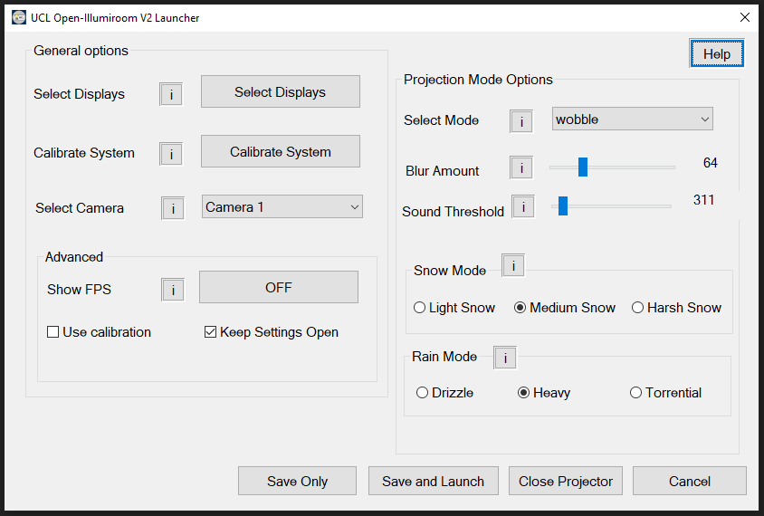
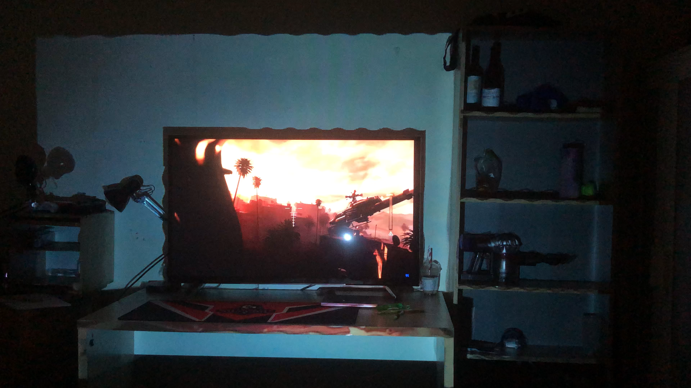
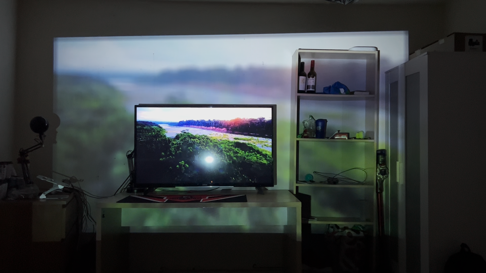
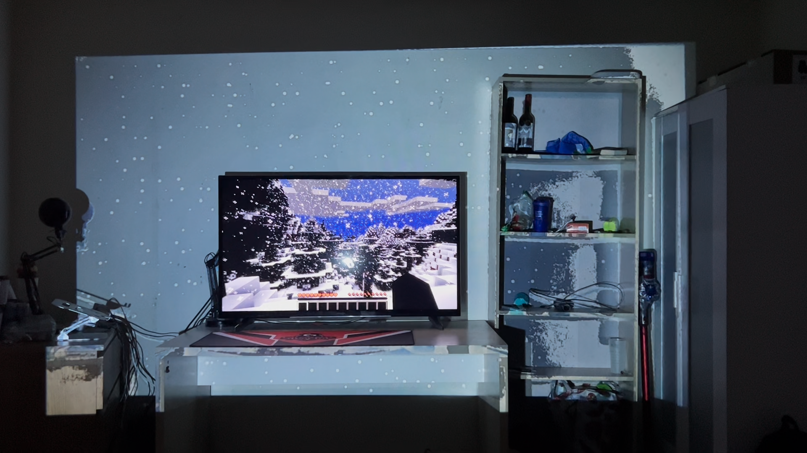
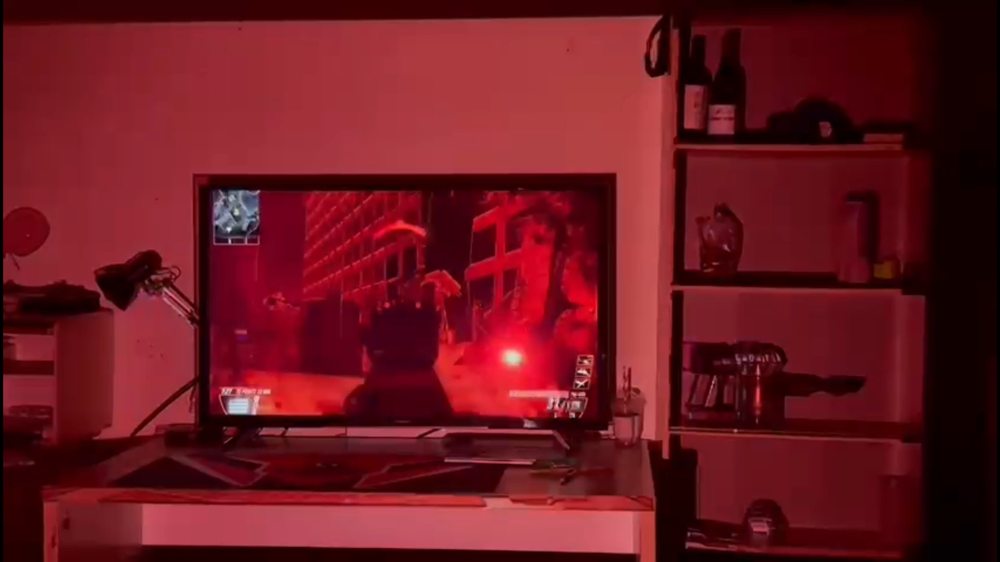

<!-- Improved compatibility of back to top link: See: https://github.com/othneildrew/Best-README-Template/pull/73 -->
<a name="readme-top"></a>
<!--
*** Thanks for checking out the Best-README-Template. If you have a suggestion
*** that would make this better, please fork the repo and create a pull request
*** or simply open an issue with the tag "enhancement".
*** Don't forget to give the project a star!
*** Thanks again! Now go create something AMAZING! :D
-->


<!-- PROJECT LOGO -->
<br />
<div align="center">
    

  </br>

  # UCL Open-Illumiroom V2

  <h3 align="center">
    UCL Open-Illumiroom V2 creates real-time, accessible, expanded experiences for TV-based gaming and entertainment by projecting effects with a projector, around a user’s TV.   </h3>
    <br />

</div>


<!-- ABOUT THE PROJECT -->
## About The Project


UCL Open-Illumiroom V2 creates real-time, accessible, expanded experiences for TV-based gaming and entertainment by projecting effects with a projector, around a user’s TV.  

With 8 different modes currently in operation, and the possibility for many more to be developed, UCL Open-Illumiroom V2 offers unparalleled possibilities for creating more immersive experiences.  

The system can be run on any computer running Windows, and supports game consoles, such as the Xbox One, Xbox Series S and more!  

The system has been released as an open-source project, licensed under LGPL V3.0 so that developers can extend the system and create their own projection modes. Users may also download the system from the Microsoft Store and try it out for themselves! 


Our project websites can be found here:

* [Expanded Experiences - Showcase Site](https://expandedexperiences.com)

* [Full Project Portfolio Site](https://students.cs.ucl.ac.uk/2022/group33/)

A Compiled build of UCL Open-Illumiroom V2 without source code can be downloaded here:

* [Compiled build of UCL Open-Illumiroom V2](https://liveuclac-my.sharepoint.com/:u:/g/personal/zcabfab_ucl_ac_uk/EdvzbsUXgClAp6Bh4rVZVqEB1gvCvXol217_-jzAm144Sw?e=4b5gig)

The calibration system is powered by Space Unfolded, find out more here:

* [Space unfolded repository](https://github.com/lomqer/SpaceUnfolded)


</br>

## Built With

The UCL Open-Illumiroom V2 system is primarily built in **Python**, as such the packages are Python based. 

The calibration system was implemented in C++ and compiled to an executable and a set of DLLS. 

The following Python libraries were used for the main application.
</br>

  | Library     | License             |
  | ----------- | --------------------|
  | CV2         | BSD                 |
  | Numpy       | BSD                 |
  | MSS         | Zlib                |
  | PySide 2    | LGPL v3.0           |
  | Nuitka      | Apache Version 2.0  |
  | Pytesseract | Apache Version 2.0  |
  | Librosa     | ISC                 |

</br>

  The following libraries were used for the calibration executable
  | Library     | License            |
  | ----------- | ------------------ |
  | OpenCV      | Apache Version 2.0 |
  | CGAL        | ...                |

</br>

<!-- GETTING STARTED -->
## Getting Started

To get started on working with UCL Open-Illumiroom V2, please follow the following steps


### Installation of the Main System


1. Clone the UCL Open-Illumiroom V2 repo
   ```sh
   git clone https://github.com/FabianBindley/IllumiroomGroup33COMP0016.git
   ```
  
2. Install Python Libraries
   ```sh
    pip install -r app/requirements.txt
   ```
3. Launch UCL Open-Illumiroom V2

    You may either run _app/UCL_Open-Illumiroom_V2.py_  to run the main system directly, or run from the command line.
   ```js
    python app/UCL_Open-Illumiroom_V2.py
   ```

3. Launch with arguments

    To open the display selection, or calibration methods run with the following arguments:

    Display Selection
    ```js
    python app/UCL_Open-Illumiroom_V2.py display
    
    ```

    Calibration
    ```js
    python app/UCL_Open-Illumiroom_V2.py calibration
    
    ```
    > More information is provided in _app/UCL_Open-Illumiroom_V2.py_

Before you launch UCL Open-Illumiroom V2, we would strongly reccomend that you select your displays, to ensure that your primary and projection displays are correct. 

</br>

<!-- GETTING STARTED -->
## Compilation

To compile the main UCL Open-Illumiroom V2 system, the Nuitka library is used. Nuitka compiles from Python source-code to C source-code, allowing for a distributable build to be generated.

Compiled builds can be found in _/release/UCL_Open-Illumiroom_V2.dist_ and 
UCL_Open-Illumiroom_V2.exe will be generated and included in this folder.

All required libraries are statically linked in the distributable.

To compile the app, run the following bash command in a bash shell:

```sh
python -m nuitka --standalone --enable-plugin=tk-inter  --enable-plugin=pyside2  --output-dir=release --remove-output --disable-console  app/UCL_Open-Illumiroom_V2.py; cp -r app/settings release/UCL_Open-Illumiroom_V2.dist; cp -r app/assets release/UCL_Open-Illumiroom_V2.dist
``` 
</br>

If you wish to create a distributable with a console output, please do not  include the '_--remove-output_' flag. 

  > A build with a console output should not be deployed, only used for debugging purposes

</br>

<!-- MFC Run and Development -->
## Launcher - Run and Development
UCL Open-Illumiroom V2 makes use of a MFC based launcher to change settings in compiled builds.

<div align="center">
  
</div>


To use the launcher, copy it from _MFC/UCL Open-Illumiroom V2 Launcher.exe_ into the same directory as your _UCL_Open-Illumiroom_V2.dist_ folder.

Then, click on _UCL Open-Illumiroom V2 Launcher.exe_ to open the launcher.

For more information on how to use, and develop the launcher MFC, please see the `Deployment Manual.pdf`, located in the repository root directory.


</br>

<!-- USAGE EXAMPLES -->
## Usage Examples

For examples of usage, check out our videos in our [YouTube Playlist](https://youtube.com/playlist?list=PL4F6J_rGxMlWONsFE6XF6Bffhcyg3ZkSA)

They summarise the setup and different projection modes.


### This is UCL Open-Illumiroom V2

UCL Open-Illumiroom V2's primary advert, briefly showing our coolest projection modes! The calibration process is shown first, then the projection modes.

</br>
<div align="center">

  [](https://www.youtube.com/watch?v=QwhNlhRxhog)
</div>
</br>

### Setup and Projection Modes | UCL Open-Illumiroom V2 Dev Log

In this video, the typical software setup process and the projection modes are shown! 

</br>

<div align="center">

   [](https://www.youtube.com/watch?v=uJ6AWTfBZs8)
</div>
</div>

</br>

## Project Gallery


### Wobble

The wobble mode triggers a sinusoidal distortion centred around the TV screen whenever an explosive sound is detected.

<div align="center">
  
  </br>
</div>


### Blur

The blur mode simply projects a blurred version of the content shown on the primary display.

<div align="center">
  
  </br>
</div>

### Snow

The snow mode generates a falling snow effect and the user can switch between light, medium and harsh snow.

<div align="center">
  
  </br>
</div>

### Low Health

The low health mode makes the projection area turn red when the player is on low health in a first-person shooter game.

<div align="center">
  
  </br>
</div>


</br>
</br>
<!-- PROJECT ROADMAP -->

## Project Roadmap

- [x] Deploy to Microsoft Store
- [ ] Create more projection modes
- [ ] F1 Data visualisation using MultiViewer for F1 App
- [ ] Error handling needs to be improved


</br>

<!-- CONTRIBUTING -->
## Contribute to UCL Open-Illumiroom V2

Contributions are what make the open source community such an amazing place to learn, inspire, and create. Any contributions you make are **greatly appreciated**.

If you have a suggestion that would make this better, please fork the repo and create a pull request. 
Don't forget to give the project a star! Thanks again!

1. Fork the Project
2. Create your Feature Branch (`git checkout -b AmazingFeature`)
3. Commit your Changes (`git commit -m 'Add some AmazingFeature'`)
4. Push to the Branch (`git push origin AmazingFeature`)
5. Open a Pull Request

</br>

<!-- LICENSE -->
## License

Distributed under the LGPL-3.0 License. See `LICENSE.txt` for more information.

</br>

<!-- CONTACT -->
## Contact

* Fabian Bindley - [LinkedIn](https://www.linkedin.com/in/fabian-bindley-741827221/) - fabian.bindley.21@ucl.ac.uk
* Aishwarya Bandaru - [LinkedIn](https://www.linkedin.com/in/aishwaryab1/) - aishwarya.bandaru.21@ucl.ac.uk
* Damian Ziaber - [LinkedIn](https://www.linkedin.com/in/damian-ziaber/) - damian.ziaber.21@ucl.ac.uk
* Chan Lee - [LinkedIn](https://www.linkedin.com/in/chan-hyuk-lee-27b67522b) - chan.lee.21@ucl.ac.uk


Main repository link: [https://github.com/FabianBindley/UCL-Open-Illumiroom-V2](https://github.com/FabianBindley/UCL-Open-Illumiroom-V2)
Calibration repository link: [https://spaceunfolded.com](https://spaceunfolded.com)

</br> 

<!-- ACKNOWLEDGMENTS -->
## Acknowledgments

Thank you very much to those who created the following resources:

* [GNU Lesser General Public License v3 (LGPL-3.0)](https://www.tldrlegal.com/license/gnu-lesser-general-public-license-v3-lgpl-3)
* [Flaticon - Icons for documentation](https://www.flaticon.com/search?type=icon&search-group=all&word=process&license=&color=&shape=&current_section=&author_id=&pack_id=&family_id=&style_id=&choice=&type=)
* [This ReadMe Template](https://github.com/othneildrew/Best-README-Template)
* [ChatGPT was very useful for drafting code DocStrings for documentation](https://chat.openai.com/chat)


